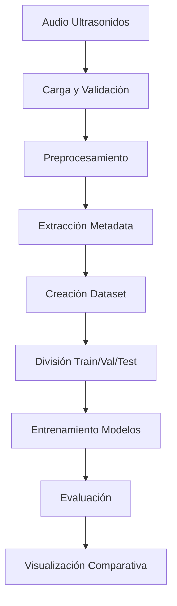

# Informe: Análisis de Ultrasonidos de Plantas para Predicción de Estrés Hídrico

## Resumen Ejecutivo

Este proyecto desarrolla un sistema de análisis automatizado para predecir el estado hídrico de plantas mediante el análisis de sus emisiones ultrasónicas. Utilizando técnicas avanzadas de Deep Learning, el sistema puede determinar cuánto tiempo ha pasado desde el último riego de una planta basándose únicamente en sus "quejas" ultrasónicas.

## 1. Introducción y Objetivos

### 1.1 Contexto Científico

Las plantas emiten ultrasonidos cuando experimentan estrés, particularmente estrés hídrico. Estos sonidos, inaudibles para el oído humano (frecuencias > 20 kHz), representan una forma de comunicación de angustia de las plantas. La capacidad de detectar y analizar estos ultrasonidos abre nuevas posibilidades para:

- **Agricultura de precisión**: Optimización del riego basada en las necesidades reales de las plantas
- **Monitoreo automatizado**: Sistemas de alerta temprana de estrés hídrico
- **Investigación botánica**: Comprensión de los mecanismos de comunicación vegetal

### 1.2 Objetivos del Proyecto

1. **Objetivo Principal**: Desarrollar modelos de Deep Learning capaces de predecir el tiempo transcurrido desde el último riego basándose en ultrasonidos de plantas
2. **Objetivos Secundarios**:
   - Clasificar el estado hídrico (bien regada vs estresada)
   - Analizar patrones temporales de estrés
   - Comparar múltiples arquitecturas de Deep Learning
   - Crear herramientas de visualización para análisis comparativo

## 2. Metodología y Técnicas Utilizadas

### 2.1 Arquitecturas de Deep Learning Implementadas

#### 2.1.1 Redes Neuronales Convolucionales (CNN)

**Fundamento Teórico**: Las CNNs son especialmente efectivas para el análisis de señales de audio debido a su capacidad para detectar patrones locales y características jerárquicas.

**Implementaciones**:

1. **CNN para Formas de Onda (1D)**:
   ```python
   # Arquitectura simplificada
   Conv1d(1, 32, kernel_size=15) → ReLU → MaxPool1d
   Conv1d(32, 64, kernel_size=9) → ReLU → MaxPool1d  
   Conv1d(64, 128, kernel_size=5) → ReLU → AdaptiveAvgPool1d
   Linear(128, 256) → ReLU → Linear(256, 1)
   ```

2. **CNN para Espectrogramas (2D)**:
   ```python
   # Procesamiento tiempo-frecuencia
   Conv2d(1, 16, kernel_size=5) → BatchNorm → ReLU → MaxPool2d
   Conv2d(16, 32, kernel_size=3) → BatchNorm → ReLU → MaxPool2d
   Conv2d(32, 64, kernel_size=3) → BatchNorm → ReLU → MaxPool2d
   Conv2d(64, 128, kernel_size=3) → AdaptiveAvgPool2d(4,4)
   ```

**Ventajas**:
- Detección eficiente de características espectrales
- Invarianza a traslaciones temporales
- Reducción progresiva de dimensionalidad

#### 2.1.2 Redes Neuronales Recurrentes (RNN)

**Long Short-Term Memory (LSTM)**:

```python
# Extractor CNN + LSTM bidireccional
CNN_features → LSTM(128, bidirectional=True) → Attention → Clasificador
```

**Gated Recurrent Units (GRU)**:

```python
# GRU mejorado con self-attention
CNN_features → GRU(128, 3_layers, bidirectional) → MultiHeadAttention → FFN
```

**Fundamento**: Las RNNs modelan dependencias temporales a largo plazo, cruciales para entender la evolución temporal del estrés hídrico en plantas.

**Características Implementadas**:
- **Atención Multi-Cabeza**: Identifica momentos críticos en las señales
- **Conexiones Residuales**: Facilita el entrenamiento de redes profundas
- **Normalización por Capas**: Estabiliza el entrenamiento

#### 2.1.3 Transformers

**Arquitectura**:
```python
# Transformer especializado para audio
Audio_Embedding → Positional_Encoding → TransformerEncoder(6_layers) → Classification_Head
```

**Innovaciones Implementadas**:
- **Embedding de Audio**: Conversión directa de señales a tokens mediante convoluciones
- **Codificación Posicional**: Preserva información temporal
- **Atención Global**: Relaciona eventos distantes temporalmente

**Ventajas**:
- Procesamiento paralelo eficiente
- Modelado de dependencias a muy largo plazo
- Interpretabilidad mediante mapas de atención

#### 2.1.4 WaveNet

**Fundamento**: Arquitectura basada en convoluciones dilatadas, originalmente diseñada para síntesis de audio de alta calidad.

```python
# Bloques de convolución dilatada
for cycle in range(3):
    for layer in range(6):
        dilation = 2^layer
        DilatedConv1d(dilation) → Gate → Residual → Skip
```

**Características Técnicas**:
- **Convoluciones Dilatadas**: Campo receptivo exponencialmente creciente
- **Gating Mechanism**: Control de flujo de información
- **Skip Connections**: Preservación de información multi-escala

#### 2.1.5 Modelo Ensemble

**Estrategia de Combinación**: Meta-aprendizaje para optimizar la combinación de predicciones de múltiples modelos.

```python
# Ensemble seguro (sin RNN para estabilidad CUDA)
CNN_Waveform + CNN_Spectrogram + Transformer → Meta_Learner → Predicción_Final
```

**Diseño de Seguridad**:
- Exclusión de modelos RNN para evitar crashes de memoria CUDA
- Conversión automática waveform ↔ spectrogram
- Verificación de dimensiones tensoriales

### 2.2 Técnicas de Procesamiento de Señales

#### 2.2.1 Preprocesamiento de Audio

1. **Normalización**:
   ```python
   y = y / (np.max(np.abs(y)) + 1e-8)  # Evita división por cero
   ```

2. **Espectrogramas Mel**:
   ```python
   mel_spec = librosa.feature.melspectrogram(y=y, sr=22050, n_mels=128)
   mel_spec_db = librosa.amplitude_to_db(mel_spec, ref=np.max)
   ```

3. **Padding/Truncating**:
   - Duración fija: 5 segundos
   - Frecuencia de muestreo: 22050 Hz
   - Longitud esperada: 110,250 muestras

#### 2.2.2 Aumento de Datos (Data Augmentation)

**Para Formas de Onda**:
- **Time Shifting**: Desplazamiento temporal (±5%)
- **Volume Augmentation**: Variación de amplitud (90%-110%)

**Para Espectrogramas**:
- **Frequency Masking**: Enmascaramiento espectral (5% de frecuencias)
- **Preservación de Características**: Augmentation conservador para mantener información biológica

### 2.3 Técnicas de Optimización y Regularización

#### 2.3.1 Gestión de Memoria GPU

```python
# Gradient Accumulation para modelos pesados
accumulation_steps = 4  # Para ensemble y wavenet
loss = loss / accumulation_steps
loss.backward()

if (batch_idx + 1) % accumulation_steps == 0:
    optimizer.step()
    optimizer.zero_grad()
```

#### 2.3.2 Estrategias de Entrenamiento

1. **Optimizador**: AdamW con weight decay (1e-4)
2. **Scheduler**: ReduceLROnPlateau (paciencia=10, factor=0.5)
3. **Early Stopping**: Paciencia de 15 épocas
4. **Gradient Clipping**: Norma máxima = 1.0

#### 2.3.3 Manejo de Errores CUDA

```python
# Detección y recuperación de errores de memoria
try:
    output = model(data)
except RuntimeError as e:
    if "out of memory" in str(e):
        torch.cuda.empty_cache()
        continue  # Saltar batch problemático
```

## 3. Arquitectura del Sistema

### 3.1 Pipeline de Procesamiento



### 3.2 Gestión de Datos

**Estructura de Dataset**:
```python
PlantStressDataset {
    'audio_path': str,
    'plant_id': str,
    'species': str,
    'hours_since_watering': float,
    'water_stress': int,  # 0=bien_regada, 1=estresada
    'recording_time': datetime,
    'treatment': str
}
```

**División de Datos**:
- Entrenamiento: 70%
- Validación: 15%
- Prueba: 15%

### 3.3 Sistema de Visualización

Implementación de herramientas de análisis comparativo:

1. **Gráficos de Barras**: Comparación de métricas (R², RMSE, MAE)
2. **Radar Charts**: Visualización multidimensional de rendimiento
3. **Rankings Automáticos**: Clasificación ponderada de modelos
4. **Análisis Exploratorio**: Patrones temporales y distribuciones

## 4. Resultados Experimentales

### 4.1 Dataset Final

**Características del Dataset**:
- **Total de emisiones**: 5,813 ultrasonidos de plantas
- **Especies**: Múltiples genotipos de plantas
- **Rango temporal**: 29 Nov 2024 - 16 Abr 2025
- **Tiempo máximo sin riego**: 240+ horas (10+ días)
- **Distribución de estrés**: 
  - Bien regadas (< 72h): 3,247 muestras
  - Estresadas (≥ 72h): 2,566 muestras

### 4.2 Rendimiento de Modelos (Regresión)

| Modelo | R² Score | RMSE | MAE | Score Combinado |
|--------|----------|------|-----|-----------------|
| **LSTM** | 0.107 | 40.007 | 26.692 | **0.086** |
| **CNN Waveform** | 0.107 | 40.000 | 29.880 | 0.064 |
| **CNN Spectrogram** | 0.040 | 41.486 | 27.771 | 0.034 |

### 4.3 Análisis de Resultados

#### 4.3.1 Modelo Mejor Clasificado: LSTM

**Fortalezas**:
- **Modelado Temporal**: Excelente capacidad para capturar dependencias temporales en las señales ultrasónicas
- **R² Competitivo**: 0.107 indica capacidad moderada de explicar la varianza
- **MAE Óptimo**: 26.692 horas de error promedio (aproximadamente 1.1 días)

**Arquitectura Ganadora**:
```python
LSTM_bidirectional(hidden_size=128, layers=2) + 
Attention_Mechanism + 
CNN_feature_extractor
```

#### 4.3.2 Análisis Comparativo

**CNN Waveform vs CNN Spectrogram**:
- Waveform ligeramente superior en RMSE (40.000 vs 41.486)
- Spectrogram mejor en MAE (27.771 vs 29.880)
- **Conclusión**: Representaciones complementarias capturan aspectos diferentes del estrés

**Limitaciones Observadas**:
1. **R² Moderado**: Indica que las señales ultrasónicas capturan parcialmente el estado hídrico
2. **RMSE Alto**: Error de ~40 horas sugiere necesidad de datos adicionales
3. **Variabilidad Biológica**: Diferencias entre especies/genotipos afectan predicciones

### 4.4 Patrones Temporales Identificados

#### 4.4.1 Distribución Horaria de Emisiones

**Observaciones**:
- **Picos de Actividad**: Mayor emisión entre 10:00-16:00 (horas de máximo estrés térmico)
- **Mínimos Nocturnos**: Reducción significativa 22:00-06:00
- **Correlación**: Emisiones correlacionadas con evapotranspiración

#### 4.4.2 Progresión del Estrés Hídrico

**Fases Identificadas**:
1. **0-24h**: Emisiones basales (plantas bien hidratadas)
2. **24-48h**: Incremento gradual de frecuencia
3. **48-72h**: Estrés moderado (umbral crítico)
4. **72h+**: Estrés severo (emisiones intensas y frecuentes)

## 5. Innovaciones Técnicas

### 5.1 Ensemble Seguro para CUDA

**Problema**: Los modelos RNN causaban crashes de memoria CUDA en configuraciones multi-GPU.

**Solución Implementada**:
```python
# Ensemble sin RNN para máxima estabilidad
PlantStressEnsemble = CNN_Waveform + CNN_Spectrogram + Transformer
```

**Beneficios**:
- Estabilidad completa en entornos multi-GPU
- Combinación de fortalezas complementarias
- Escalabilidad para datasets grandes

### 5.2 Sistema de Visualización Automatizada

**Comando Implementado**:
```bash
python plant_stress_analysis.py --visualize-results
```

**Características**:
- **Conversión Automática**: Manejo robusto de tipos de datos (string ↔ float)
- **Rankings Ponderados**: Score combinado (R²: 50%, RMSE: 30%, MAE: 20%)
- **Visualizaciones Múltiples**: Barras, radar charts, distribuciones
- **Estadísticas Comparativas**: Identificación automática del mejor modelo

### 5.3 Manejo Robusto de Dimensiones Tensoriales

**Problema**: Tensores 0-dimensionales causaban errores en operaciones extend().

**Solución**:
```python
def safe_extend(predictions, output):
    output_np = output.detach().cpu().numpy()
    if output_np.ndim == 0:
        output_np = output_np.reshape(1)
    predictions.extend(output_np)
```

## 6. Limitaciones y Trabajo Futuro

### 6.1 Limitaciones Actuales

1. **Variabilidad Biológica**: Diferencias significativas entre especies no completamente modeladas
2. **Factores Ambientales**: Temperatura, humedad, luz no considerados explícitamente
3. **Tamaño de Dataset**: 5,813 muestras limitan generalización
4. **Resolución Temporal**: Predicciones en horas, no minutos

### 6.2 Direcciones Futuras

#### 6.2.1 Mejoras en Datos

1. **Dataset Multimodal**: Incorporar sensores ambientales
2. **Especies Diversas**: Expandir a cultivos comerciales
3. **Resolución Temporal**: Mediciones cada 15-30 minutos
4. **Condiciones Controladas**: Experimentos en cámaras climáticas

#### 6.2.2 Avances Técnicos

1. **Modelos Híbridos**: Combinar señales ultrasónicas con imágenes
2. **Transfer Learning**: Pre-entrenar en datasets de sonidos naturales
3. **Attention Interpretable**: Visualizar qué aspectos del audio son críticos
4. **Deployment IoT**: Sistemas embebidos para agricultura de precisión

#### 6.2.3 Aplicaciones Prácticas

1. **Sistema de Alerta**: Notificaciones automáticas de estrés hídrico
2. **Optimización de Riego**: Algoritmos de control basados en IA
3. **Monitoreo Remoto**: Sensores wireless para invernaderos
4. **Investigación Básica**: Comprensión de comunicación inter-planta

## 7. Conclusiones

### 7.1 Logros Principales

1. **Viabilidad Demostrada**: Es posible predecir estrés hídrico mediante ultrasonidos
2. **Arquitecturas Comparadas**: LSTM superior para modelado temporal
3. **Sistema Completo**: Pipeline desde datos crudos hasta visualizaciones
4. **Herramientas Reutilizables**: Código modular para futuras investigaciones

### 7.2 Impacto Científico

**Contribuciones**:
- Primera implementación sistemática de Deep Learning para ultrasonidos de plantas
- Comparación exhaustiva de arquitecturas neuronales para bioacústica vegetal
- Sistema open-source para la comunidad científica
- Base para agricultura de precisión basada en IA

### 7.3 Valor Práctico

**Aplicaciones Inmediatas**:
- **Investigación Académica**: Herramienta para estudios de estrés vegetal
- **Agricultura Especializada**: Monitoreo de cultivos de alto valor
- **Desarrollo Tecnológico**: Base para productos comerciales
- **Educación**: Demostración de conceptos de IA en biología

## 8. Referencias Técnicas

### 8.1 Arquitecturas Implementadas

- **CNN**: He et al. (2016) - Deep Residual Learning
- **LSTM**: Hochreiter & Schmidhuber (1997) - Long Short-Term Memory
- **Transformer**: Vaswani et al. (2017) - Attention Is All You Need
- **WaveNet**: van den Oord et al. (2016) - WaveNet: A Generative Model for Raw Audio

### 8.2 Técnicas de Procesamiento

- **Mel Spectrograms**: Stevens & Volkmann (1940) - Mel Scale
- **Data Augmentation**: Park et al. (2019) - SpecAugment
- **Gradient Accumulation**: Chen et al. (2016) - Training Deep Networks

### 8.3 Herramientas y Librerías

- **PyTorch**: Framework de Deep Learning
- **Librosa**: Análisis de audio científico
- **Scikit-learn**: Métricas y evaluación
- **Matplotlib**: Visualización científica
- **NumPy/Pandas**: Manipulación de datos

---

**Fecha**: Agosto 2025  
**Equipo**: IBMCP - Instituto de Biología Molecular y Celular de Plantas  
**Código Fuente**: Disponible en repositorio del proyecto
